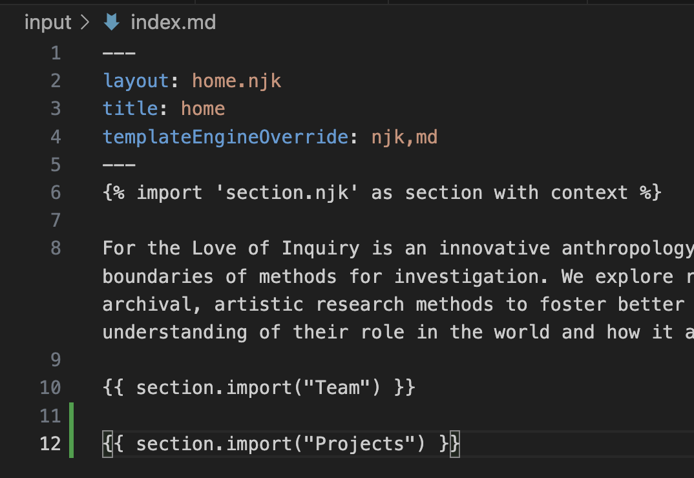
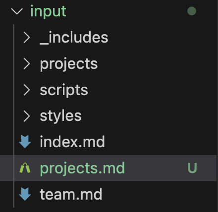
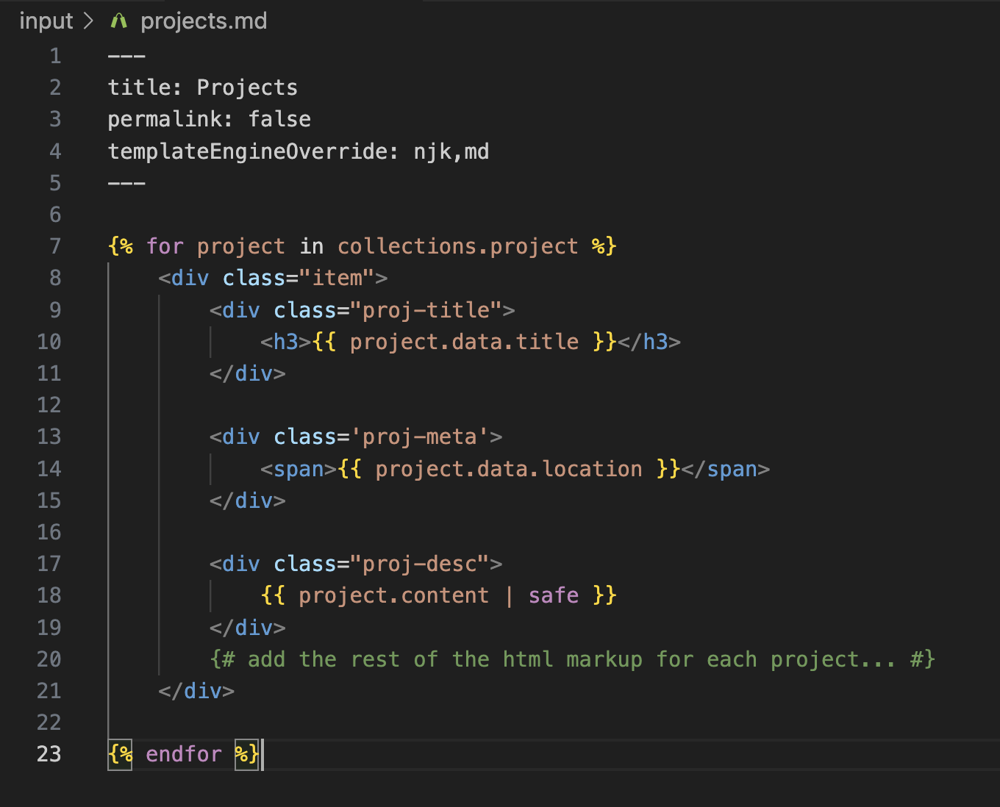
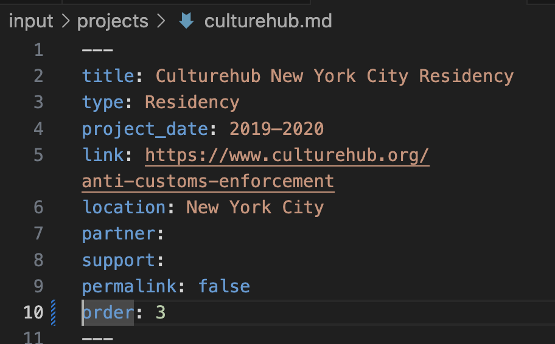

We can start by adding an import for a section called "projects" in `index.md`:

Obviously no file corresponds to this yet. We're going to create one, in the root folder of `input` (the same level as `team.md` and `index.md`)

But the content of projects is different from `team.md` or any generic section, because it's supposed to generate a list of all the projects with custom HTML markup and styling. I considered it, and I think the easiest way to accomplish this will be to write nunjucks directly into the `projects.md` file. See below:

To break down what is happening here:

1. Just like in all the other markdown files except `index`, we set `permalink` to `false` so it doesn't generate a separate page. Additionally, we set `templateEngineOverride` to accept nunjucks (njk), so we can write nunjucks directly into this file.

2. `collections.project` is [eleventy's built-in method](https://www.11ty.dev/docs/collections/#a-blog-example) of accessing all posts with the tag "project". It gives us an array of JS objects representing each project.

3. ` ... ` is [Nunjucks syntax](https://mozilla.github.io/nunjucks/templating.html#for) for a _for_ loop. It loops through every project in the array, and generates whatever HTML you want it to, while inserting data for each project in the loop. You can see I added the project title, location, and rendered markdown content as an example. 

A few notes:

* By doing the project templating directly in `projects.md`, we don't need to change anything about `_includes/section.njk`. We can also actually delete `_includes/project.njk`, because it never gets used for anything.

* In the demo above, projects are sorted according to Eleventy's default sorting method (which I believe is file creation date). I would start by just getting this working. But in the future we can set it to sort by project date, or allow the team to set a custom order using a number field in the front matter of each project:

* I realize I never really explained fully how `section.njk` works. This file defines a nunjucks "macro", which is [documented here](https://mozilla.github.io/nunjucks/templating.html#macro). As it says, these are sort of analogous to functions in JS. They take input parameters (in this case, the page name), and output templatized HTML using that information.